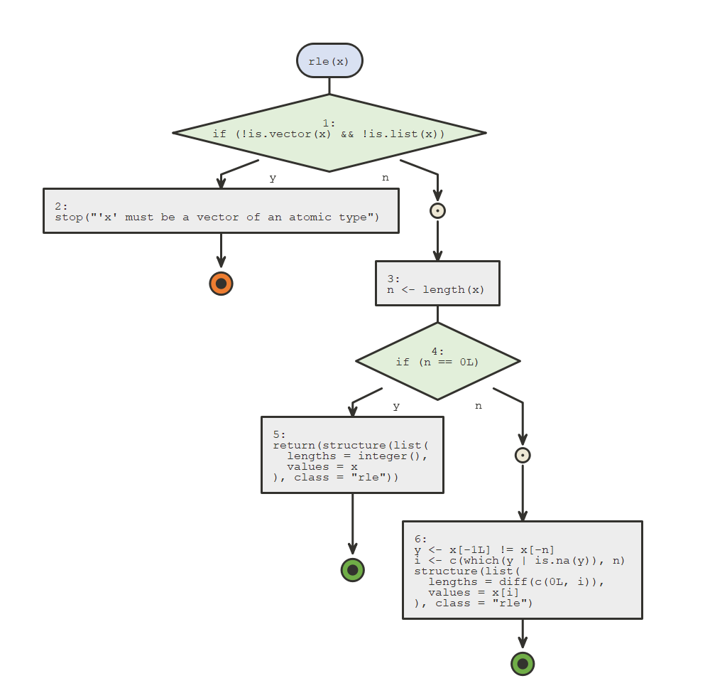

<!-- badges: start -->
[](https://travis-ci.org/moodymudskipper/flow) [](https://codecov.io/gh/moodymudskipper/flow?branch=master) <!-- badges: end -->

flow
====

Visualize as flow diagrams the logic of functions, expressions or scripts and ease debugging.

-   Call `flow_view()` on a function, a quoted expression, or the path of an R script to visualize it.

-   Call `flow_run()` on a call to a function to visualize which logical path in the code was taken. Set `browse = TRUE` to debug your function block by block (similar to `base::browser()`) as the diagram updates.

-   Export to *html*, *png*, *jpeg*, or *pdf*.

-   Use the Rstudio addins to run `flow_view()` or `flow_run()` on your selection.

Installation
------------

Install with:

``` r
devtools::install_github("moodymudskipper/flow")
```

Example
-------

``` r
library(flow)
flow_view(median.default)
```


