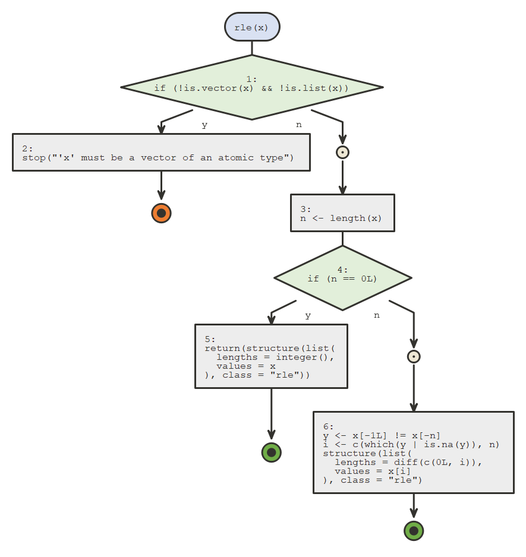

<!-- badges: start -->

[](https://github.com/moodymudskipper/flow/actions)
<!-- badges: end -->

# flow 

*{flow}* provides tools to visualize as flow diagrams the logic of
functions, expressions or scripts and ease debugging.

Use cases are :

  - Deciphering other people’s code
  - Getting more comfortable with our own code by easing a visual
    understanding of its structure
  - Documentation
  - Debugging
  - Inspect unit test results
  - Providing a higher level view of an algorithm to collaborators
  - Education

## Installation

Install from CRAN with:

``` r
install.packages("flow")
```

Or install development version from github:

``` r
remotes::install_github("moodymudskipper/flow")
```

## Example

``` r
library(flow)
```

Using default nomnoml engine

``` r
flow_view(rle)
```



Using plantuml engine (make sure the
[{plantuml}](https://github.com/rkrug/plantuml) package is installed).

``` r
flow_view(rle, engine = "plantuml")
```


## Notes

Make sure to check the vignettes for a detailed breakdown of all
features.

*{flow}* is built on top of Javier Luraschi’s *{nomnoml}* package, and
Rainer M Krug ’s *{plantuml}* package, the latter only available from
[github](https://github.com/rkrug/plantuml) at the moment.
