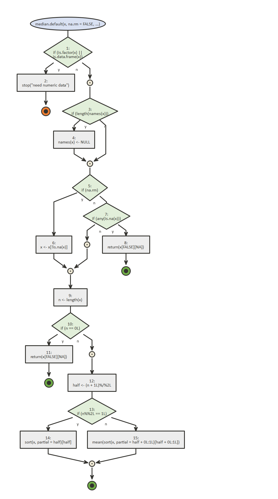

<!-- badges: start -->

[](https://travis-ci.org/moodymudskipper/flow)
[](https://codecov.io/gh/moodymudskipper/flow?branch=master)
<!-- badges: end -->

# flow 

Visualize as flow diagrams the logic of functions, expressions or
scripts and ease debugging.

  - Call `flow_view()` on a function, a quoted expression, or the path
    of an R script to visualize it.

  - Call `flow_run()` on a call to a function to visualize which logical
    path in the code was taken. Set `browse = TRUE` to debug your
    function block by block (similar to `base::browser()`) as the
    diagram updates.

  - Export to *html*, *png*, *jpeg*, or *pdf*.

  - Use the Rstudio addins to run `flow_view()` or `flow_run()` on your
    selection.

  - Document an entire package with `flow_doc()`

*{flow}* is built on top of Javier Luraschi’s *{nomnoml}* package, and
Rainer M Krug ’s *{plantuml}* package, the latter only available from
github at the moment (“rkrug/plantuml”).

More on the website : <https://moodymudskipper.github.io/flow>

## Installation

Install with:

``` r
remotes::install_github("moodymudskipper/flow")
```

## Example

``` r
library(flow)
flow_view(median.default)
```



There are way too many features to show them all on a README, check the
vignette [Draw a
function](https://moodymudskipper.github.io/flow/articles/Draw-a-function.html)
for a deeper dive. More vignettes to come\!

The following code gives you a taste of the possibilities.

``` r
# use plantuml
flow_view(median.default, engine = "plantuml")

# exports (supports png, jpeg, pdf, html)
# shortcuts are available to export to temp file and open
# (often easier to explore there than in the IDE)
flow_view(median.default, out = "png")

# visualize which path was taken (relevant S3 method is presented)
vec <- c(1:3, NA)
flow_run(median(vec, na.rm = TRUE))

# works when code fails too (handy to debug!)
flow_run(median(iris))

# show the number of passes on each edge
flow_run(Reduce(`+`, 1:4), show_passes = TRUE)

# step by step exploration
vec <- c(1:3, NA)
flow_run(median(vec, na.rm = TRUE), browse = TRUE)
# then enter `d` to draw the diagram at the relevant step

# check what path is taken inside of `mean.default` when median is called
flow_debugonce(mean.default)
median(1:4)
```
