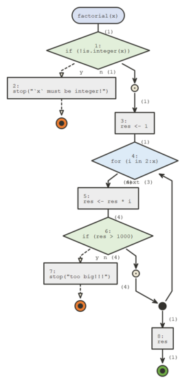

```{r, include = FALSE}
knitr::opts_chunk$set(
  collapse = TRUE,
  comment = "#>"
)
```

This section introduces the `browse` argument of `flow_run()` and the functions
`flow_debug()` and `flow_debugonce()`

## `browse`

`flow_run()` runs a call and displays the logical path that was taken, but what
if we'd like to walk through the code step by step, as we would by inserting a 
`browser()` call in our function's body or calling `debug` or `debugonce` on our
function ?

In these cases we can use the `browse` argument, set it to `TRUE` and you'll
be able to browse through the function as it's run. And refresh the diagram
by typing `d` or the equivalent `flow_draw()`

## `flow_debug` and `flow_debugonce`

`flow_run` is convenient to inspect the logic of a function that we call directly,
sometimes we might want to inspect a call that's part of another function's body.

In this situation we can use `flow_debug` and `flow_debug_once`. These work a lot
like `debug` and `debugonce` when using `browse = TRUE`.

```{r}
library(flow)

flow_debugonce(factorial)
factorial5 <- function(){
  x <- 5L
  factorial(x)
}
factorial5()
```



