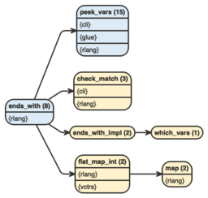

```{r, include = FALSE}
knitr::opts_chunk$set(
  collapse = TRUE,
  comment = "#>"
)
library(flow)
```

Version 0.1.0 features experimental functions to display different kinds of flow diagrams.

These are not stable but already useful and since developing flow takes time I though
it'd be useful to release them as they are for the time being. Please report issues
or upvote existing ones on github if you'd like to see more work happening there.

## `flow_view_vars()`

`flow_view_vars()` shows dependencies between variables in a function, this kind
of functions cannot be made completely robust but seems to work quite well
if you don't use `assign` and don't reuse variable names all over the place.

Full lines are direct dependencies, dashed lines are dependencies through control flow.
Variables are repeated when they are modified.

Let's test it on `tidyselect::ends_with`

```{r}
tidyselect::ends_with
```

```{r, eval = FALSE}
flow_view_vars(tidyselect::ends_with)
```


If we don't want to repeat the variable we can set `expand = FALSE`, the resulting
diagram doesn't reflect the sequence of modifications but sums up dependencies
more clearly as it is more compact.

```{r, eval = FALSE}
flow_view_vars(tidyselect::ends_with, expand = FALSE)
```


Use the `out` argument to export these diagrams.

## `flow_view_deps()`

`flow_view_deps()` shows dependencies between functions in a package.

Exported functions are blue, unexported are yellow, the number of lines of code
is indicated between brackets (useful to detect small helpers).

By default functions called from other non base packages are shown but don't
create new nodes.

```{r, eval = FALSE}
flow_view_deps(tidyselect::ends_with)
```


We can collapse those to show only packages : 

```{r, eval = FALSE}
flow_view_deps(tidyselect::ends_with, show_imports = "packages")
```


Or not show those at all :

```{r, eval = FALSE}
flow_view_deps(tidyselect::ends_with, show_imports = "none")
```


There are many ways to tweak the output, in particular we can :

* promote functions from other packages so they'll have their own node

```{r, eval = FALSE}
flow_view_deps(tidyselect::ends_with, promote = "purrr::map")
```


* Demote functions from the target package to treat them as functions from other packages.

```{r, eval = FALSE}
flow_view_deps(tidyselect::ends_with, demote = "peek_vars")
```


* Hide a function altogether :

```{r, eval = FALSE}
flow_view_deps(tidyselect::ends_with, hide = c("peek_vars", "purrr::map"))
```


* Trim to stop recursing after a given function:

```{r, eval = FALSE}
flow_view_deps(tidyselect::ends_with, trim = "peek_vars")
```


Use the `out` argument to export these diagrams.


## `flow_view_shiny()`

#' This function displays a shiny app's module structure, . If you call for instance `flow_view_shiny()` on a function that runs the app and
#' uses both the main server and ui functions, you'll display the full graph of server and ui modules.

`flow_view_shiny()` is a wrapper around `flow_view_deps()` to show the structure
of a shiny app. It assumes the app is built on top of module functions named a certain way (adjustable through the `pattern` argument). 

It works nicely on apps built with {golem} or follow the same
kind of structure (good practice basically), such as those that you'd build following the
recommendations in Hadley Wickham's "Mastering Shiny". 

Apps that use `source()` are not well supported but it might come as we found it's quite common (though
probably not good practice).

Here's an example using the great {esquisser} app.

```{r, eval = FALSE}
flow_view_shiny(esquisse::esquisser, show_imports = "none")
```


Use the `out` argument to export these diagrams.

## `flow_view_uses()`

`flow_view_uses()` is basically `flow_view_deps()` in reverse, it shows all
functions that call directly or indirectly on another function. It is not
very robust yet but it's already useful.

```{r, eval = FALSE}
flow_view_uses(purrr:::accum_index)
```


## `flow_compare_runs()`

`flow_compare_runs()` compares two calls to the same function. 

Whenever the calls diverge we color the blocks differently (orange for `x`,
green for the `ref`) and we count separately the passes on the edges.

```{r, eval = FALSE}
flow_compare_runs(rle(NULL), rle(c(1, 2, 2, 3)))
```


## `flow_embed()`

`flow_embed()` can be used to embed flow diagrams into your roxygen documentation

```{r}
#' Add or subtract
#' 
#' This is a useless function that adds or subtract numbers
#' 
#' See its logic in this flow diagram:
#' 
#' `r flow_embed(flow_view(add_or_subtract), "add_or_subtract")`
#' 
#' @param x string
#' @param y string
#' @param what "add" or "subtract"
add_or_subtract <- function(x, y, what = c("add", "subtract")) {
  what <- match.arg(what)
  if (what == "add") {
    x + y
  } else {
    x - y
  }
}
```


