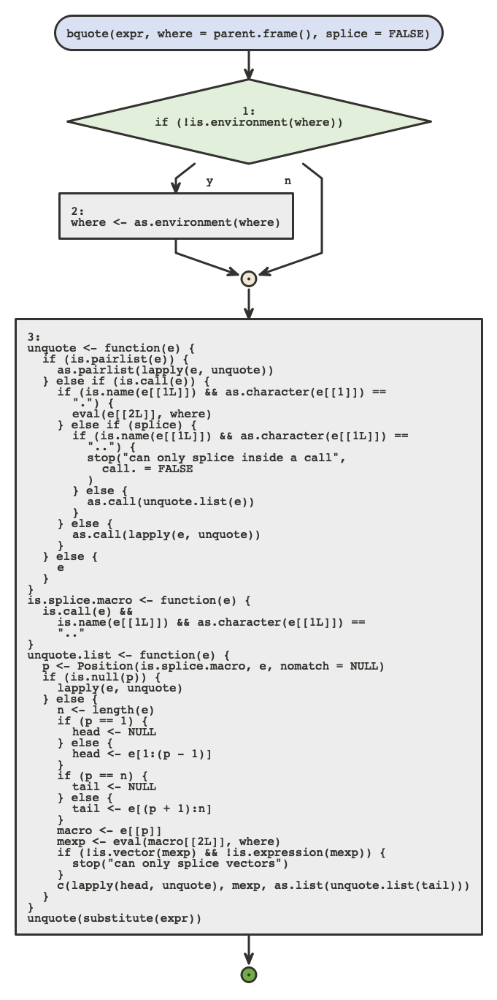
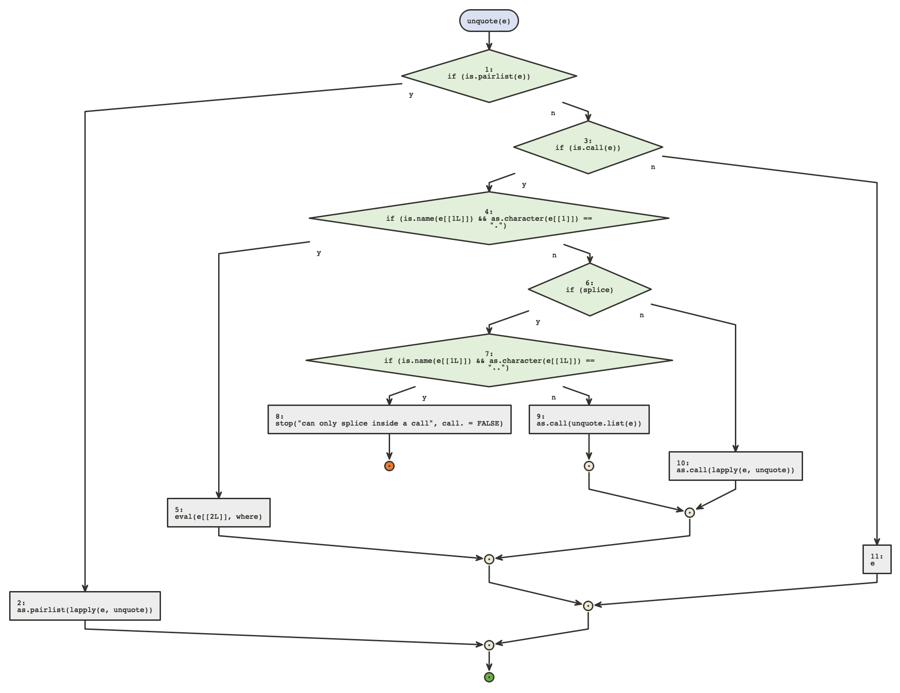
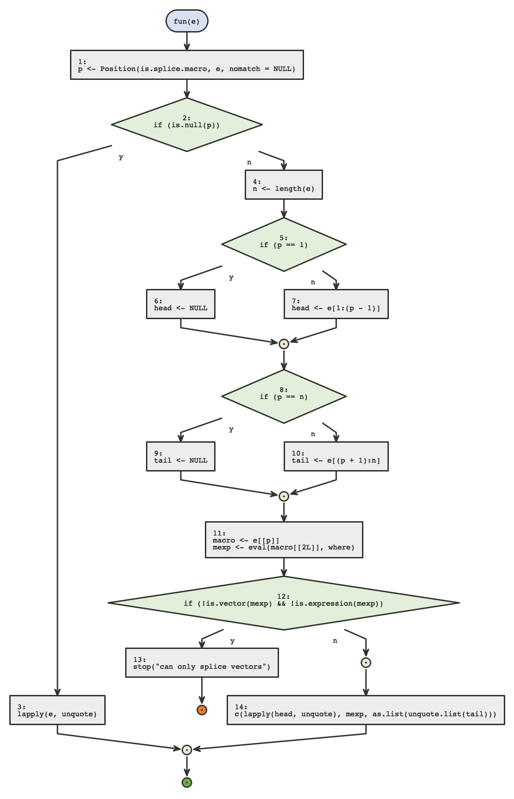

```{r, include = FALSE}
knitr::opts_chunk$set(
  collapse = TRUE,
  comment = "#>"
)
```

Many times a function will contain another function definition, these will
not always be very readable in the body of the main function. *{flow}* offers
a way to visualize those.

When using flow on the main function, a message will signify what nested functions
can be viewed. The base function `bquote` is a good example.

```{r, eval = FALSE}
library(flow)
flow_view(bquote)
```



We can then inspect those by using the `nested_fun` argument, with a numeric id
or a name (if unambiguous)

```{r, eval = FALSE}
flow_view(bquote, nested_fun = "unquote")
```



```{r, eval = FALSE}
flow_view(bquote, nested_fun = 3)
```


