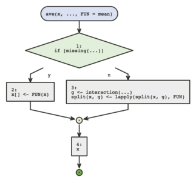
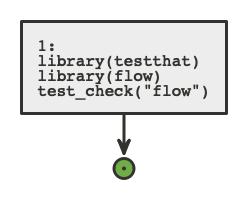
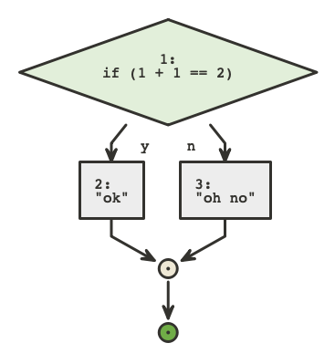
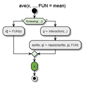
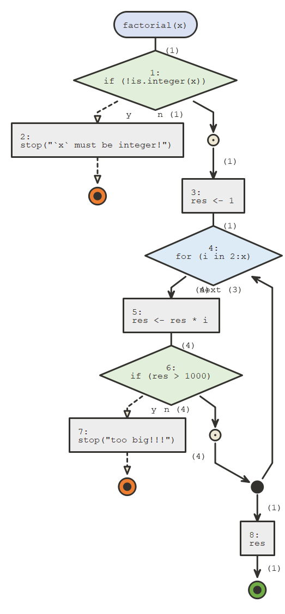
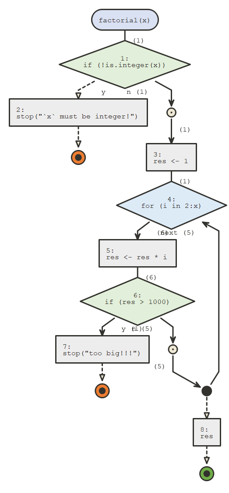

```{r, include = FALSE}
knitr::opts_chunk$set(
  collapse = TRUE,
  comment = "#>"
)
```

*{flow}*'s two main functions are `flow_view()` and `flow_run()`, which require only one argument for the simplest use cases.

```{r setup}
library(flow)
```

## `flow_view()`

`flow_view()` is used to display the logic of a function, a one item named list containing a function, a script or a quoted
expression.

```{r, eval = FALSE}
# display a function's body
flow_view(ave)
```



```{r, eval = FALSE}
# if non standard evaluation is an issue, use a one element named list
fun <- ave
flow_view(list(ave = fun))
```


```{r, eval = FALSE}
# display script
flow_view("../tests/testthat.R")
```



```{r, eval = FALSE}
# display quoted expression
flow_view(quote(if(1 + 1 == 2) {"ok"} else {"oh no"}))
```



`if` statements always branch into two paths, whether an `else` clause is present
or not. `for`, `while`, and `repeat` loops are also supported.

The colored circles are exit points, orange for errors (using `stop()`), 
green for returned values (using `return()`) or just reaching the end of the function.

If you installed *{plantuml}* you can set `engine` to `"plantuml"`, *plantuml* 
diagrams are a bit less flexible but they often look more polished and compact.

```{r, eval = FALSE}
# display a function's body
flow_view(ave, engine = "plantuml") 
```



## `flow_run()`

`flow_run` actually executes a call to a function, and displays the logical path.
It takes as a first argument an unquoted call to the function we want to dive in.

```{r}
factorial <- function(x) {
  if(!is.integer(x)) stop("`x` must be integer!")
  res <- 1
  for(i in 2:x) {
    res <- res * i
    if(res > 1000) stop("too big!!!") 
  }
  res
}
```


```{r}
flow_run(factorial(5L))
```



`flow_run()` counts how many times code blocks
were entered and these numbers are displayed next to the edges between parenthesis.

It can also be used on calls that fail, which is convenient for debugging, for
instance the following call fails :

```{r, error = TRUE}
flow_run(factorial(10L))
```



If you call `flow_run()` on a call to an S3 generic, the appropriate S3 method
will be represented.

```{r, eval=TRUE}
vec <- c(1:3, NA)
flow_run(median(vec, na.rm = TRUE))
```


The `"plantuml"` engine is not supported by `flow_run()`.
